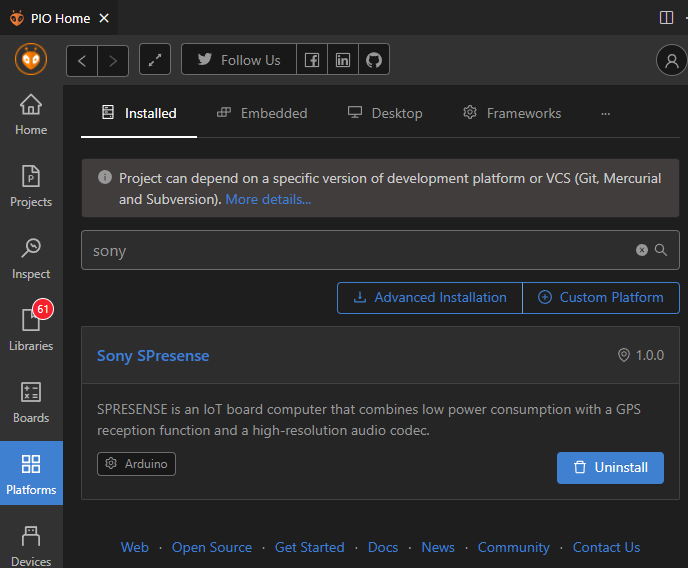
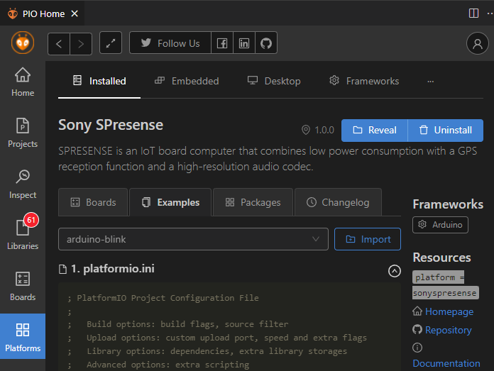
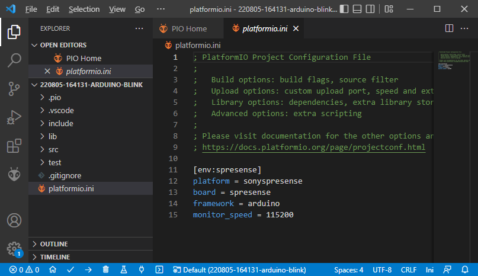
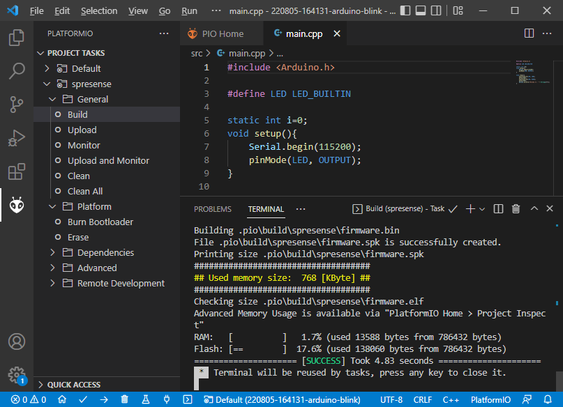
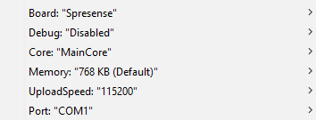

# Sony Spresense PIO Platform

## Description

PlatformIO integration for Sopny Spresense board and Arduino core.

## Boards
*  Spresense (Sony CXD5602GG)

## Frameworks
* [Arduino](https://github.com/sonydevworld/spresense-arduino-compatible)

## Installation

Open a [PlatformIO Core CLI](https://docs.platformio.org/en/latest/integration/ide/vscode.html#platformio-core-cli) and execute

```
pio pkg install -g -p https://github.com/maxgerhardt/platform-sonyspresense.git
```
to install this platform.

In [PIO Home](https://docs.platformio.org/en/latest/integration/ide/vscode.html#platformio-toolbar), you should then have the Sony SPresense platform installed.



## Updating

Due to a technicallity with how the Arduino framework's `package.json` is inside a subfolder but pulled from git, regular updating is broken. To update the platform, reinstall it cleanly using

```sh
pio pkg uninstall -g -p sonyspresense
pio pkg install -g -p https://github.com/maxgerhardt/platform-sonyspresense.git
```

## First Test

In the PIO Home's platform view for Sony SPresense, you can go into the "Examples" tab and import the "arduino-blink" example via the "Import" button.



When the import is done, you should have a VSCode project open that has the Arduino Blink example imported into it.



From there, open the `src/main.cpp` and check that there are no errors shown. (If yes, you might need to execute the "build" task).

In the [project tasks](https://docs.platformio.org/en/latest/integration/ide/vscode.html#project-tasks) then, execute the "Build Task". 
It should end with "success".



Use the above shown "Upload" task to upload the firmware onto a connected SPresense board, or directly use "Upload and Monitor" to also open the device (serial) monitor after that.

## Special Project Tasks

As shown in the screenshot above, this platform impleemnts the "Erase" and "Burn Bootloader" command also available in the Arduino IDE. The "Erase" command will erase the firmware on the board. The "Burn Bootloader" command will burn the SDK firmwares (`loader.espk`, `gnssfw.espk`, ..) onto the board.

## Import notes

Currently, `flash_writer.py` is used as a cross-platform way to upload the firmware. This script has a dependency on `wxPython`. If you are on Linux, please execute
```sh
sudo apt-get install -y libgtk-3-dev python3-wxgtk4.0
```
so that the later `pip install wxPython` will succeed when building a firmware.

We will be looking to drop this huge dependency from the script.

## Build Settings

In the Arduino IDE, you have the following build settings available to you:



These can be replicated in PlatformIO by adding the configuration options to the `platformio.ini` of the project. Note that if there multiple `build_flags` lines, you have to combine the options into one line.

###  Debug

```ini
; Release: is the default
; Debug: 
build_flags = -DPIO_FRAMEWORK_ARDUINO_ENABLE_DEBUG
```

###  Core

```ini
; Main Core: is the default
; SubCore1:
build_flags = -DPIO_FRAMEWORK_ARDUINO_CORE_SUB_CORE_1
; SubCore2:
build_flags = -DPIO_FRAMEWORK_ARDUINO_CORE_SUB_CORE_2
; SubCore3:
build_flags = -DPIO_FRAMEWORK_ARDUINO_CORE_SUB_CORE_3
; SubCore4:
build_flags = -DPIO_FRAMEWORK_ARDUINO_CORE_SUB_CORE_4
; SubCore5:
build_flags = -DPIO_FRAMEWORK_ARDUINO_CORE_SUB_CORE_5
```

###  Memory

Choose from 
* 128K (131072)
* 256K (262144)
* 384K (393216)
* 512K (524288)
* 640K (655360)
* 768K (786432)
* 896K (917504)
* 1024K (1048576)
* 1152K (1179648)
* 1280K (1310720)
* 1408K (1441792)
* 1536K (1572864)

and input as follows:

```ini
; 1.5 MByte
board_upload.maximum_size = 1572864
board_upload.maximum_ram_size = 1572864
```
###  Upload speed

```ini
; 115200 is the default
; use 921600
upload_speed = 921600
```
###  Upload port

```ini
; is auto-detected by default
; use specific port
upload_port = COM7
```

### Example

```ini
[env:spresense]
platform = sonyspresense
board = spresense
framework = arduino
build_flags = 
  -DPIO_FRAMEWORK_ARDUINO_ENABLE_DEBUG
  -DPIO_FRAMEWORK_ARDUINO_CORE_SUB_CORE_1
board_upload.maximum_size = 1572864
board_upload.maximum_ram_size = 1572864
upload_speed = 921600
upload_port = COM7
; for serial monitor
monitor_speed = 115200
```

For more options, see [PlatformIO documentation](https://docs.platformio.org/en/latest/projectconf/section_env.html#working-env-name),
